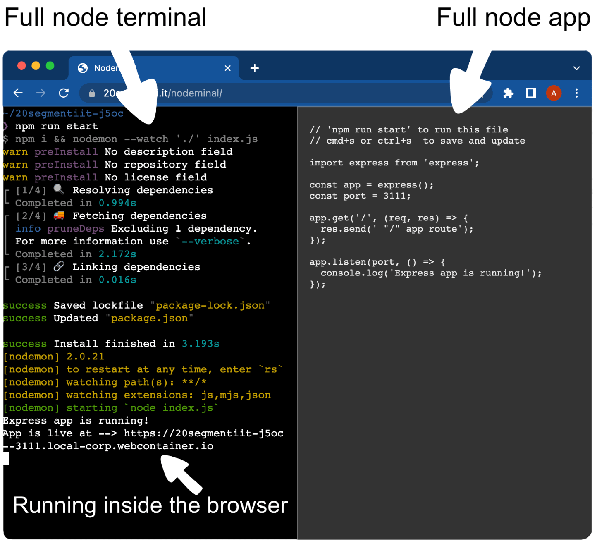

<h1 align="center">Nodeminal 💻</h1>
<h3 align="center">The easiest way to run node code on the fly</h3>
<br>

<div align="center">
    
</div>

## Thanks to
This repo uses the WebContainer Api. Special thanks to https://webcontainers.io
<br>
(Does not currently work on Safari (03.2023))

## How to use it locally

```
npm i
npm run start
```

## How to use it online
```
npm run build
```
Then publish the `build` folder wherever you want (https required).


## How to run your node code on the fly
On the left terminal you can install any node package you need inside your node app.
<br>
On the right you can edit your code. You can import stuff from whatever package you installed, connect to an external db, and expose some api routes.

Run `npm run start` inside the left terminal to start you app, and every time you save your code the app restarts automatically.

Your app will be live at the url shown in the left terminal.

An that's it :)

